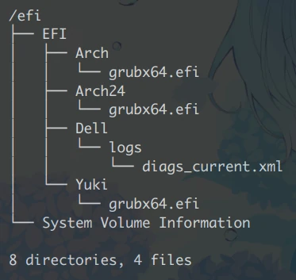

由于我对 Linux 乃至整个 UEFI 的启动机制尚且“浅尝辄止”，本文并不会展开很多硬核内容，只是对我个人使用过的启动方案做个总结。

::: tip 引导和启动
在维基百科中二者似乎是同一概念[^wikipedia_booting]，搜索“启动程序”会跳转到[“引导程序”](https://zh.wikipedia.org/wiki/%E5%95%9F%E5%8B%95%E7%A8%8B%E5%BC%8F)的介绍。

[^wikipedia_booting]: 另见英文维基：[Booting](https://en.wikipedia.org/wiki/Booting)。

国内很多折腾 WinPE 的人（包括我）对此也并没有很明确的区分；当然有些博客则对开机装载 Linux 的过程拆分成引导、启动两个阶段。本文为了方便起见，用词不作区分。
:::

在此感谢岛风 [@frg2089](https://github.com/frg2089) 指路。

## UEFI 启动简述：启动项管理

> UEFI 规范定义了名为“UEFI 启动管理器”的一项功能……（它）是一种固件策略引擎，可通过修改固件架构中定义的全局 NVRAM 变量来进行配置。启动管理器将尝试按全局 NVRAM 变量定义的顺序依次加载 UEFI 驱动和 UEFI 应用程序（包括 UEFI 操作系统启动装载程序）。……
> ::: right
> ——[（译）UEFI 启动：实际工作原理](https://www.cnblogs.com/mahocon/p/5691348.html)
> :::

本“议题”只讨论 UEFI 原生启动项和回退路径启动项。恕不对 BIOS 兼容的部分作详细展开。

### i. 原生启动项
用 Windows 7 及更高版本系统的朋友肯定知道这个东西：Windows Boot Manager。`bootmgr`它代替了`ntldr`，从此便沿用至今。

事实上，Windows Boot Manager 是系统安装完成后，初次加载系统时为其创建的**原生启动项**。它明确指出需要启动**指定设备中**的**指定引导文件**（即`bootmgfw.efi`）。

即便 WinToGo 也是如此——在以 U 盘身份进入 WTG 系统时，Windows 也会悄悄地把原生启动项建立好。然后重启之后再按快捷键进入启动菜单，你**可能**会在**部分主板上**发现有两个启动项，指向同一个设备：
```
Windows Boot Manager ( Koi Series Pro ...)
USB HDD: Koi Series Pro ...
```
需要注意的是，原生启动项是**存储在主板里的**（更准确的说，是全局 NVRAM 变量）。有些主板在检测到原生启动项失效（找不到指定引导文件）后，会自行删除该启动项。比如安装 Grub 后更换过硬盘，后来又把原盘插回去，可能仍然找不到 Grub 启动项。

### ii. 回退路径启动项
对于 WinPE、Windows 安装镜像而言，它们并非用于长线运行，不可能到处添加原生启动项，那么 UEFI 如何认出它们捏？
还记得上面提到的同一设备双启动项吗？UEFI 固件是能够找到可启动设备，并且尝试启动的。但它是依据什么去找的捏？

UEFI 固件首先会**遍历各硬盘的 ESP 分区**，并在其中查找`\EFI\BOOT\boot{cpu_arch}.efi`。前面的这一固定路径就称为**回退路径**，通过查找回退路径建立的启动项就称作**回退路径启动项**。其中，`cpu_arch`即 CPU 架构，已知的有：
- `x64`：x86-64
- `ia32`：x86-32
- `ia64`：Itanium
- `arm`：AArch32，即 arm32 <del>（胳膊 32）</del>
- `aa64`：AArch64，即 arm64 <del>（64 条胳膊）</del>

> [!note]
> UEFI 的路径系统与 Windows 类似：以`\`分隔，不区分大小写。

如果同一硬盘、同一 CPU 架构存在多个匹配的 EFI 文件（比如，可能有两个 ESP 分区，分开装不同系统的 EFI），那么**只会选第一个有效的**去执行。

对于 WinPE U 盘，通常它们是 MBR 分区表，那么会考虑更泛用的搜索：采用 **FAT** 文件系统的**活动分区**；
对于 GPT 分区表，可以直接搜索 ESP 分区。当然如今的主板并不会卡那么死，哪怕只是普通的 FAT 分区，也会尝试搜索、执行。

也就是说，哪怕原生启动项意外被固件扬了，只要还有回退启动项，便仍可从同一个硬盘启动系统。

::: info
实际上`bcdboot`工具会在 ESP 分区里同时写入`bootx64.efi`和`bootmgfw.efi`。前者即回退路径启动项。

有关`bootx64.efi`、`bootmgr(.efi)`和`bootmgfw.efi`的关系可能有些复杂，谷歌了一圈各种观点都有。本着实事求是的原则，我不会糅合这些观点提出假设，只附上几个问题：
- `bootx64.efi`、`bootmgfw.efi`（或`bootmgr`）分别在本机 Windows、WinToGo 和 WinPE 中起到什么作用？三者之间是否存在等价（即功能上可以替代，乃至文件哈希相同）？
- fwbootmgr（即`bootmgfw.efi`）与 bootmgr，是谁“悄悄地”为 UEFI NVRAM 添加原生启动项？
:::

## 启动加载器（以 Grub 为主）
这也是最广泛使用的启动方式<del>，Windows 也干了</del>。在 Linux 当中，最常用的加载器是 Grub。当然，也有使用 rEFInd 的。

启动加载器（bootloader）本身作为跳板，被 UEFI 固件加载后，需要根据配置找到真正的 Linux 内核，并经由内核引导用户硬盘上的 Arch 系统。而在 Windows 中，`boot[a-z]{3,4}.efi`会根据`BCD`配置文件，执行硬盘其中一个 Windows 副本中的`winload.efi`，并将该副本的其余加载流程交给它完成。

正常使用 Windows 单系统的用户可能对启动过程并无察觉，但一旦与 Linux 混用，你就需要**留意 Linux 的加载器会不会被 Windows 刷下去（甚至被覆盖）**。除此之外，固件和内核之间隔着加载器这么一块跳板，势必会拖慢引导流程。因此就个人来说，我不会再考虑 Grub 这类方案了。

### i. 修复 Grub 引导
Windows 启不动我们会尝试修复引导，Arch 亦然。修复 Grub 引导实际上就是**重走 Grub 安装流程**：

- `mount`挂载相应分区；
- `genfstab`重建挂载表（如有必要）；
> 个人建议无论如何都重建一遍`fstab`。反正刷完绝对是最新的。
- `arch-chroot`切换进硬盘上的系统；
- `grub-install`重建 grub 引导。
- `grub-mkconfig`重建 grub 配置（可能不需要……？）。

### ii. 改用回退启动项
事实上，需要反复重建 Grub 引导的一大原因就在于，Grub 只会写入它自己的`grubx64.efi`，以及原生启动项：



那么办法也很简单：像 Windows 那样也建一个回退路径启动项。最简单的做法当然是复制改名，若求稳妥可以考虑用`grub-install`刷：
```sh
grub-install --target=x86_64-efi --efi-directory=/efi --bootloader-id=GRUB --removable
```
当然如果是像图中那样不止一个 Grub，甚至同盘 Windows 和 Arch 双系统，那我不推荐你这么做。

> [!warning]
> 不要在这里试图用软链接节省空间！

## 固件直接引导（EFIStub）
Grub 本身写入 ESP 的内容不多，配置啊、Linux 内核啊都在`/boot`。有人便主张把`/boot`还给`/`，ESP 分区实际挂载`/efi`。
而岛风则提出了更激进的主张：让固件直接引导内核。

> An EFI boot stub (aka EFI stub) is **a kernel that is an EFI executable**,
> i.e. that can directly be booted from the UEFI.
> ::: right
> ——[Arch Wiki: EFIStub](https://wiki.archlinux.org/title/EFISTUB)
> :::

根据 Wiki，**默认情况下** Arch Linux 的内核本身就是可启动 EFI，只是需要附加[**内核参数**](https://wiki.archlinux.org/title/Kernel_parameters#Parameter_list)：
```
# 为便于阅读，这里分了三行。
root=UUID=7a6afcd0-a25a-4a6c-bf7b-920b53097eae
resume=UUID=b84ae173-edbc-442c-b00b-5c47eef203f1
rw loglevel=3 quiet initrd=\intel-ucode.img initrd=\initramfs-linux.img
```
::: details 内核参数详解
Grub 等启动加载器的本职工作就是帮你引导内核，因此它们的配置文件已经包含完整的内核参数了。
我上面列的内核参数是参照 Wiki 自行搭配，确认可行的参数。你也可以查 Wiki 自行组合。
- `root`：`/`分区。目前只见到 UUID 填法。
- `rw rootflags=subvol=@`：对`/`分区挂载的附加属性，比如可读写、指定 Btrfs 子卷。
- `resume`：休眠使用的交换分区，同样只见到 UUID 填法。休眠时会在指定 Swap 里创建内存映像。
- `loglevel=3 quiet`：内核加载时的附加属性，如日志等级之类。
- `initrd=\intel-ucode.img`：加载的初始化内存盘 (Init RAM Disk)。  
  一个`.img`一条`initrd=`，路径用`\`分隔，顺序自左向右（可以参见 grub 的配置文件）

> [!note]
> 个人觉得这里 initrd 称作“初始化映像”更合适，毕竟需要填`.img`嘛。
:::

LiveCD 里的`efibootmgr`工具可以直接操作固件的启动项。当然若是遵照律回指南和 Miku 指南，那么`efibootmgr`业已安装到你的系统中，你可以在运行中的本机 Arch 系统中折腾：
```bash
# 首先确定你要操作的硬盘和分区，不要搞错。UUID 马上就会用到。
lsblk -o name,mountpoint,uuid
# 参见 Wiki，以 Btrfs 为例，仅供参考
sudo efibootmgr --create --disk /dev/nvme0n1 --part 1 \
  --label "Arch Linux" --loader /vmlinuz-linux \
  --unicode 'root=UUID=f6419b76-c55b-4d7b-92f7-99c3b04a2a6f rw rootflags=subvol=@  loglevel=3 quiet initrd=\intel-ucode.img initrd=\initramfs-linux.img'
```
::: note 创建启动项命令详解
- `--part 1`：你的 ESP 分区序号。根据`lsblk`的树状图顺序判别。
- `--label "Arch Linux"`：启动项名称。大多数固件并不支持中文。
- `--unicode`后面跟内核参数。
:::

归根结底，EFIStub 代替了启动加载器，由我们用户手动建立 UEFI 原生启动项。但这种方式硬要说优点吧……可能也就比 Grub 快那么几秒而已。维护起来并不比 Grub 轻松多少。

## 统一内核映像（UKI）
在应用 EFIStub 的时候我就在想，有没有可能写一个`bootx64.efi`，直接带内核参数启动`vmlinuz-linux`呢。后面偶然找到了“统一内核映像”的介绍，豁然开朗。

> A unified kernel image (UKI) is a **single executable** which can be **booted directly from UEFI firmware**, or automatically sourced by boot loaders with little or no configuration.
> ::: right
> ——[Arch Wiki: Unified Kernel Image](https://wiki.archlinux.org/title/Unified_kernel_image)
> :::

根据介绍，UKI 实际上就是将内核引导的资源整合起来，打包而成的 EFI 可执行文件。某种意义上这也算是一种「固件直接引导」，只不过 EFIStub 只创建原生启动项，而它两种启动项都可以做。

::: info UKI 通常包含……
> 摘自 [UAPI Group Specifications](https://uapi-group.org/specifications/specs/unified_kernel_image/)。

- EFI 执行代码（决定它“可执行 EFI”的本质）
- Linux 内核
- 【可选】内核参数
- 【可选】初始化内存盘
- 【可选】CPU 微码
- 【可选】描述信息、启动屏幕图、设备树……（不重要）

只要集成了 EFI 执行代码和 Linux 内核，就可以称作统一内核映像了。
:::

接下来以`mkinitcpio`为例。

### i. 内核参数
Wiki 中介绍了两种方法：
- 向`/etc/cmdline.d/`里投喂`.conf`配置（文件名随意）。比如`root.conf`决定`/`如何挂载，等等。
- 直接把所有参数搓成一行 echo 喂给`/etc/kernel/cmdline`文件。

于我而言，显然第二种更方便。
```bash
# 我在 LiveCD 里 arch-chroot 进去做的。别问我为什么没权限。
echo 'root=UUID=... resume=UUID=... rw loglevel=3 quiet' > /etc/kernel/cmdline
```
与 EFIStub 不同，这里不需要指定`initrd=`——工具会自己打包。

> [!warning]
> 若启用“安全启动”，且 UKI 封装了内核参数，则 UEFI 固件会无视外部传入的其余参数。

::: info [GPT 分区自动挂载](https://wiki.archlinuxcn.org/wiki/Systemd#GPT%E5%88%86%E5%8C%BA%E8%87%AA%E5%8A%A8%E6%8C%82%E8%BD%BD)
跟 [@Vescrity](https://github.com/Vescrity)讨论的时候我俩都觉得分区 UUID 太长了，于是他尝试省略掉`root=`参数。  
就结果来看还真可行，顺带附上他的折腾记录：[《从统一内核镜像启动》](https://vescrity.github.io/post/UKI/)。
:::

### ii. 预设文件
编辑`/etc/mkinitcpio.d/linux.preset`。
```properties
#PRESETS=('default' 'fallback')
PRESETS=('default')

#default_config="/etc/mkinitcpio.conf"
#default_image="/boot/initramfs-linux.img"
#default_uki="/efi/EFI/Linux/arch-linux.efi"
default_uki="/efi/EFI/BOOT/bootx64.efi"
default_options="--splash /usr/share/systemd/bootctl/splash-arch.bmp"
```
本身 UKI 默认是丢到`esp\EFI\Linux\arch-linux*.efi`里的，相对来说已经比较通用（Grub 可以直接读，也可以用作原生启动项）。但我尝试 UKI 本就是为了摒弃前面两种方案，殊途同归反倒不值得这么整了。所以我个人选择让 UEFI 固件直接加载回退路径启动项。

### iii. 创建映像
按需建立路径，并跑一遍生成：
```bash
mkdir -p /efi/EFI/BOOT/
mkinitcpio -p linux
```
如有必要，清理系统中废旧的启动文件（`grubx64.efi`、`refind_x64.efi`等），并用`efibootmgr`手动清理遗留的原生启动项。

---

建完之后退出系统，重启按快捷键进入启动菜单，这下该有你硬盘的 UEFI 回退路径启动项了：
```
HDD: PM8512GPKTCB4BACE-E162
```
