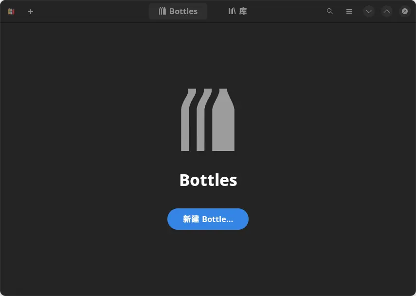
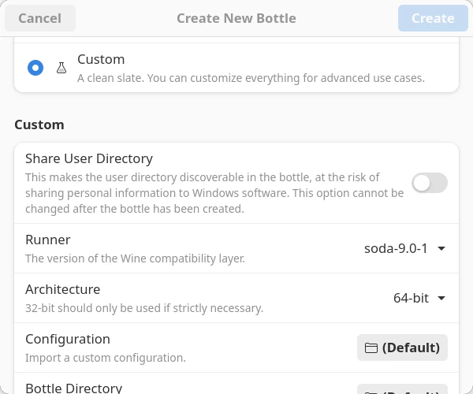
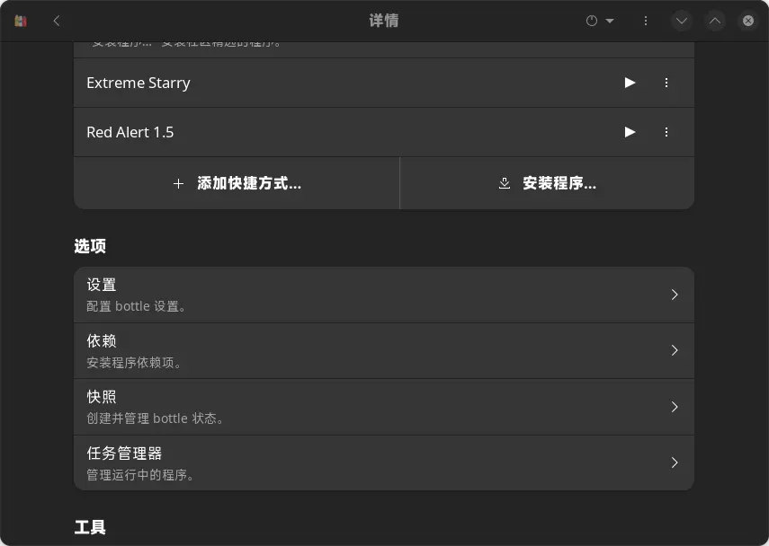
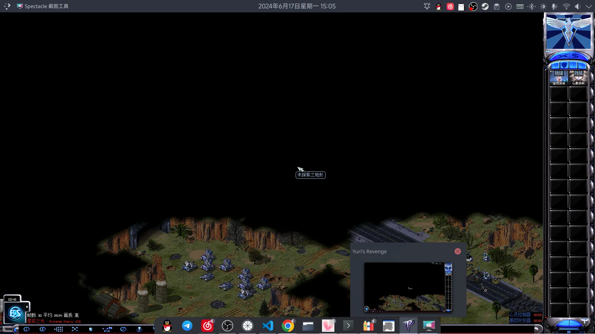
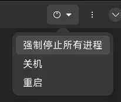

因为一些机缘巧合，现在我改用 Linux 作为主力系统了。然鹅地图我还是得做的，我又没有两台电脑搞远程，那如何在 Linux 里游玩红红、制作地图首先就成了问题。

当然有人马上会想到虚拟机，比如熟悉的 VirtualBox、VMWare，比如`winapps`。但虚拟机也好，双系统也罢，都太重量级了，我个人并不喜欢。

那都玩 Linux 了，Wine 兼容层怎么样呢？不也有过 Wine 跑《原神》的成功案例了嘛。但遗憾的是，自 9.17-1 版本开始，**原生 Wine** 的 DDraw 兼容都做得十分甚至九分的抽象，无论是红警 2 本体还是 FA2 地图编辑器都无法正常显示，原生 Wine 也就不再适用了。

> 现阶段也不再建议用 Wine 玩原神，容易被封号。可以试试云原神，但首先需要解决“鼠标无法转动视角”的问题。

所以，兜兜转转，还是回到了 Bottles。

<!-- ::: important -->
> [!important]
> 本篇笔记仅以《星辰之光》这个红警 2 模组作为范例，因为它是我这里最早成功跑起来的红警 2 mod。
> 对于其他 mod，乃至其他游戏和 Windows 程序，本篇笔记的方案可能有一定参考价值，**但不保证能够成功运行**。
<!-- ::: -->

那么正式开始之前，我有必要先说一下我的 Linux 环境。由于 Linux 发行版众多，我**无法保证别的包源、别的发行版能否这么操作**。

- 操作系统：Arch Linux
- 桌面环境：KDE 6

## 一、Bottles

Bottles 是由 [bottlesdevs](https://github.com/bottlesdevs) 开发的可视化 Wine 配置工具，旨在“让用户便利地在喜欢的发行版里运行 Windows 程序”。

> 参考链接：[GitHub](https://github.com/bottlesdevs/Bottles) [官网](https://usebottles.com/)

官方推荐通过 Flatpak 安装，在沙箱里运行。但由于“懒加载”[^lazy_loading]问题，游戏本体和地编都无法正常启动。因此还是改用`pacman`吧。

[^lazy_loading]: 经实测发现，单文件 exe 才可以在这种情况下直接在 Bottles 里启动。但凡需要读同级文件、子文件夹的，都需要在 Bottle 里添加快捷方式，并在快捷方式的设置里手动指明工作目录。

首先需要引入`archlinuxcn`源。具体步骤参见[《Arch 安装流程》](./arch-install.md#i-cn-源和-aur-助手)，这里不再重复。  
接着`sudo pacman -Sy bottles-bwrap`安装。等待进度跑完，就可以从“应用程序菜单栏”运行了。

初次运行 Bottles 会弹出一个向导跟你 blabla，无脑下一步即可。
到最后一步时 Bottles 会下载一些组件包。由于众所周知的原因，可能会花费比较长的时间。



## 二、部署 Bottle

### 2.1 新建
进入 Bottles 的主界面，点击“新建 Bottle……”（或者窗口左上角的加号），填些基本信息：

> [!note]
> 我的系统语言是英文，中文翻译仅供参考。

- 名称`Name`：自拟（为便于说明，后面用`$venv`表示）；
- 环境`Environment`：建议选自定义`Custom`。

> 应用程序`Application`和游戏`Gaming`这两个预设，初次新建 Bottle 时会下载巨量的依赖。
> 如果你网不是特别好，也没走代理，直接“自定义”就可以了。

- 打开共享用户目录`Share User Directory`选项
- 兼容层，或者说运行器`Runner`选择 soda-9.0-1（以最新版为准）

> 如果你选了预设，这里是改不了兼容层的，得等创建好 Bottle 之后进设置再改。

> 此外，cn 源的 Bottles 使用系统中装的原生 Wine。在文章开头我就强调过原生 Wine 已不适用红红。所以务必换用别的。

- Bottle 目录`Bottle Directory`可改可不改（为便于说明，后面用`$bottles`表示）。

> 默认你的环境位于`~/.local/share/bottles/bottles`目录下。

> [!warning]
> 如果你在全局设置里改过默认目录，千万不要在新建这里又改到同一个位置，否则会报**符号占用，创建失败**。



然后在右上角点击“创建”即可。

> [!note]
> 在 Linux 中，`~`和`$HOME`通常指代`/home/<user_id>` [^home_dir]，比如`/home/nyacl`。
> 类比下 Win7 的`%UserProfile%`和`C:\Users\nyacl`就知道了。
> 
> [^home_dir]: Linux 的路径是**区分大小写**的，终端里的环境变量（通常全大写）也是。  
> 即`YURI.exe` &ne; `yuri.EXE`；`$HOME` &ne; `$home`。

### 2.2 Bottle 选项

点击刚建好的 Bottle 进入详情页，点开设置`Settings`：

1. 需要开启 DirectX 翻译——将组件`Components`部分的 DXVK 和 VKD3D 打开；
2. 可以考虑在显示`Display`部分启用独立显卡`Discrete Graphics`（我的笔记本没有捏）；
3. 性能`Performance`部分的同步`Synchronization`可以考虑 Fsync，除此之外的选项建议不动；

做完设置，退回上一页把依赖`Dependencies`装上：

::: tip 红警 2 推荐依赖

- 客户端需要：`mono` (Wine mono .NET 依赖) （耗时较长，建议最后安装）
- 中日韩字体：`cjkfonts`（避免“口口文学”）

> 你也可以手动下载（或复制 C:\Windows\Fonts 里的）msyh.ttc 和 simsun.ttc，
> 并复制到`$bottles/$venv/drive_c/windows/Fonts`里。

- 游戏本体需要：`cnc-ddraw`
- Reshade 特效层需要：`d3dcompiler_*.dll` `d3dx*`

> 这里的 * 代表全都要，比如 d3dx11 和 d3dx9。
<!-- - gdiplus -->
:::

## 三、部署游戏环境

下载好《星辰之光》大版本包体（如有必要，额外再下载小更新包），用`unzip`解压：
```bash
sudo pacman -S unzip
# 请根据实际情况替换压缩包路径
unzip -O GBK -o '~/Documents/Extreme Starry v0.6.zip'
# 如果网络不好，不方便更新，并且群里恰有离线更新包，也可以直接下载、覆盖更新
unzip -O GBK -o '~/Documents/0.6.2 离线更新包.zip' -d '~/Documents/Extreme Starry'
```

::: details unzip 命令行解释
`unzip [opt] </path/to/zip> [-d extract_dir]`

- `-O encoding`：指定在 Windows 里打包的 ZIP 采用什么编码打开。
- `-o`（注意大小写不一样）：有相同文件名的，一律覆盖。
- `/path/to/zip`：zip 路径。
> 遇到空格需要加反斜杠转义，或者像我那样直接打引号。
- `-d extract_dir`：解压到单独的文件夹。
> 像上面离线包直接解压出来是散装跟`Extreme Starry`并列放的。而`~/Documents`可能不止放《星辰之光》。

更多细节还请自行`unzip -h`。虽然解说都是英文。
:::

然后点开你的 Bottle 进入详情页，为客户端`Extreme Starry.exe`添加快捷方式，这样就不需要每次都点“运行可执行程序”找半天了。  



> [!tip]
> 在“选择可执行文件”对话框中，若找不到 exe，请在“过滤”那里改为`Supported Executables`。

## 四、渲染补丁
我们知道，红警 2 是个 Windows 游戏，但众所周知，由于系统调用的不同，Windows 程序无法直接在 Linux 上跑，这点对于“渲染补丁”也是一样。
所以客户端设置也好，玩家自备`ddraw.dll`也罢，**均无法在 Wine 里使用**。

### 4.1 游戏本体
可能你会有疑问：前面不是让装`cnc-ddraw`了吗？怎么又有问题捏？因为文中的 Bottles 以及用于原生 Wine 的 Winetricks 均只提供这个。换言之，你基本上**只有`cnc-ddraw`类补丁可以选**。

除此之外，Bottle 容器与 Windows 类似，**默认从游戏目录（即“内建`Builtin`”）加载 DLL**。所以，还需要调整`ddraw.dll`加载次序。  
- 找到 Bottle 详情的“工具”一栏；
- 点开`Legacy Wine Tools`找到`Configuration`，打开`winecfg`。
- 选中函数库`Libraries`页面，在列表中选中`ddraw`，点击编辑`Edit`；  
  若找不到，**先**在上面的输入框里手打`ddraw.dll`，点击添加`Add`。
- 在弹出的 5 个选项中，选择**原装`Native` (Windows)**。

而对于 Reshade，国内有一些 Reshade 会伪装成`d3d*.dll`。由于上面提到的默认规则，这种 Reshade 实际仍能配合`ddraw.dll`运作，在游戏中显示出 Reshade 版本提示。当然具体特效显示成什么样就未经细致测试了。

::: details Wine 的 DLL 查找
经查证，前面说的`soda`、`proton`均为 Wine 的变种。所以只需讨论 Wine 的做法即可。  
总的来说，Wine 的查找与 Windows 的 KnownDlls 机制类似，但做了简化[^wine_forum_dll]：

- 内建（Builtin）：（默认优先）在程序的**当前目录**（或者叫**工作目录**，在本文中又称**游戏目录**）下查找、加载。
- 原装（Native）：（默认备选）在 Wine 容器（即`$venv`虚拟 C 盘的`System32`，可能还有`SysWOW64`）中查找。

[^wine_forum_dll]: 参见帖子 _[Wine can't find/load DLLs in the same dir](https://forum.winehq.org/viewtopic.php?t=36023)_。
:::

### 4.2 FA2 及其扩展（FA2sp 等）
开篇提到，我还有做地图的需求。

目前圈子里所谓“FA2 防卡补丁”实际是 DxWnd，它仍会加载系统目录的`ddraw.dll`。那么对本随记而言，便只需讨论“原装”的 DDraw。经过测试，刚建好的 Wine 环境其`ddraw.dll`恰可以为 FA2 所用。

> 原生 9.16-1 那版对我来说刚好，但是无视缩放比；  
> 9.17-1 及往后的新版本则会因屏幕缩放有一些拉扯感，不知高分屏用户觉得如何。  
> Proton 等 Wine 改版的表现与 9.16-1 一致。推测是并未跟进最新版本。

那需要做的就很简单了：**另起一个 Bottle 跑地编**。或者，在`cnc-ddraw`安装之前先提取出`$venv/drive_c/windows/System32`（也可能是`SysWOW64`，如果有的话）里面的`ddraw.dll`，**覆盖 DxWnd**。

## 五、开玩

在做完全部配置之后，点击你建过的快捷方式右边的`▶`图标，开耍。……虽然，读条可能会比较慢。



::: info 再次启动客户端没有反应
可能是因为进程还驻留在 Wine 环境当中，需要“强制停止所有进程”手动干掉：


:::

## 附录：关于 Syringe 命令行
> [!tip]
> 像《星辰之光》这种有独立客户端的 mod 无需查阅此附录，客户端本身就负责了命令行解析。

Linux 的文件名允许英文引号（如`"game"md.exe`），在终端里，这会给 Syringe 带来歧义：
```log
Syringe.exe "\"gamemd.exe\"" -SPAWN ...
```
解法也很简单，把它扔进批处理即可：
```cmd
PUSHD %~dp0
Syringe.exe "gamemd.exe" -SPAWN -log -cd -speedcontrol
```
然后把批处理扔进游戏目录（或者说和`gamemd.exe`放在一起），让 Wine 去启动批处理即可：
```bash
# wine 运行时会把 Linux 根目录挂载到 Z 盘。
wine cmd /c "Z:/home/agxcoy/Documents/ES-FA2/launch.cmd"
```
