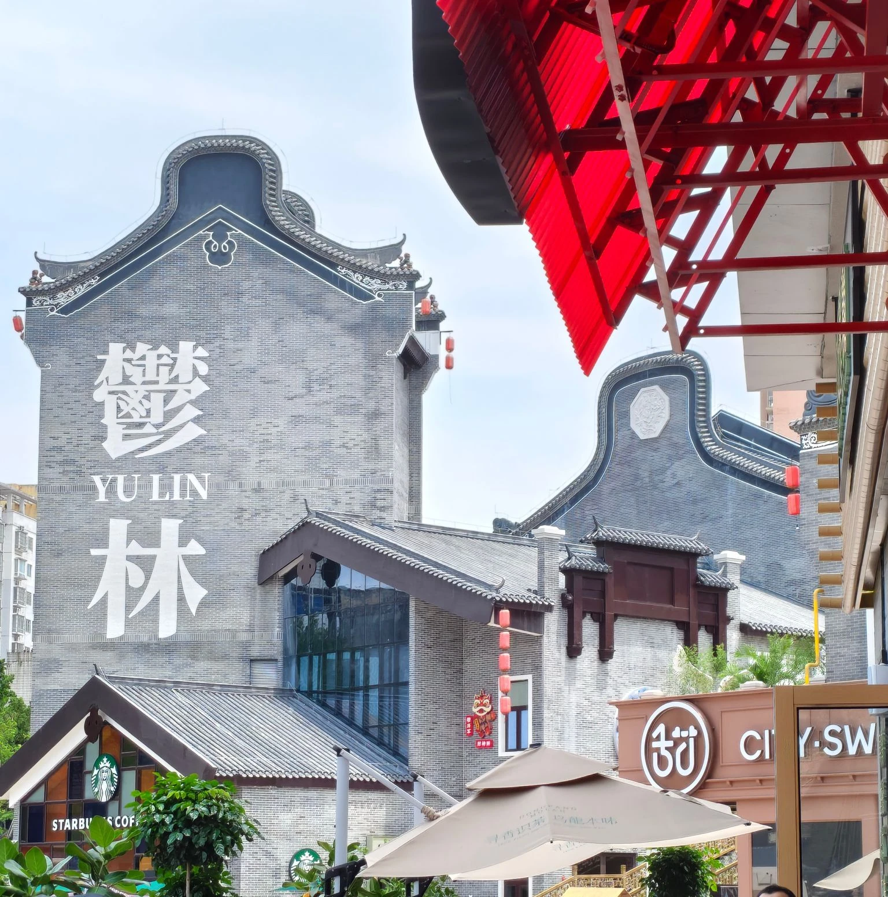
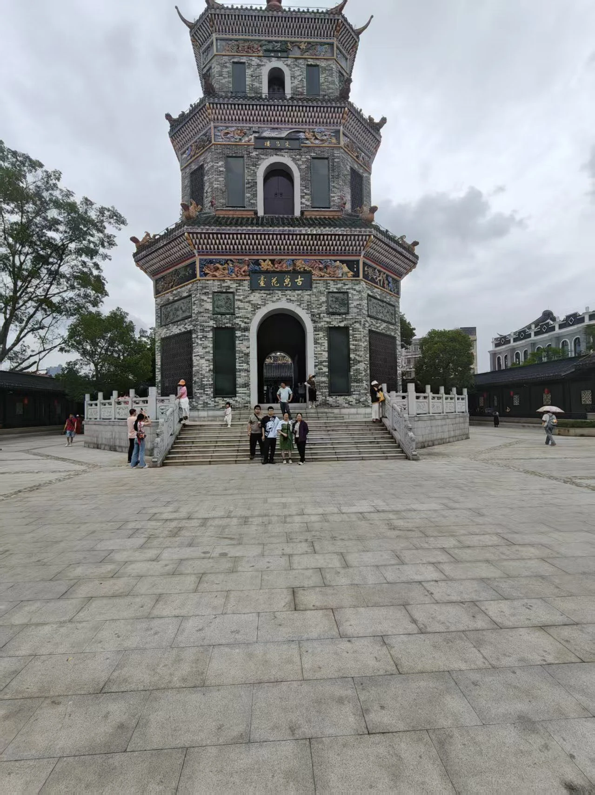

> [!note] 鸽王这一块
> ~~似乎头图不支持相对路径。那就文章开头 8。~~
> 
>
> 如你所见，已经有一段时间过去了。如果不是换主题，可能我都没动力~~提笔~~敲键盘。
>
> ~~但话又说回来，真没什么好写的（~~

23 年的五一小长假，我去了一趟成都。之前打《原神》的时候认识了个网友（大概在圈名 Caco 弃用后不久），那一趟也是和网友在成都逛。虽然那年五一玩的很开心，但很遗憾最终还是终止了关系（即清列）。

今年的五一，不知为何，游玩玉林市的时候莫名有种既视感。

---

行程没什么可聊的，自驾游刨去首尾两天。

第一天到那自然是安顿了，完事晚上去逛夜市。步行街大体上分为服装和小吃两半，入夜很多摊位在排队，总体来说相当热闹。其中有一块相对中心的区域，阁楼上有人公开演出（唱歌），恰似 2020 年在哈尔滨的老街。

有一说一我并不太喜欢过于热闹的场合，我们一行人逛得又很慢（妈咪除外，妈咪步子好快），漫步在街上不禁想起成都的春熙路——比这条街宽，人潮也流连于各种摊位：吃的、手工、然后是那块裸眼 3D 大屏。很可惜我比较挑食，逛步行街最后只买了份双皮奶吃。

次日，万花广场。有点想吐槽的是“大舞台”这个命名，还挺朴实——的确有个比较宽阔的舞台区域。“鬱将军”，财神狮也；“林将军”，状元狮也——此谓后人添的祝愿。

沿梯而上，便是万花楼的前殿。万花楼本身其实比较小，一条龙游览完花不了多久。据称因内外绘制万余花卉而得此名。“万花”绘于楼身，辅以彩色花鸟为缀，打卡的话拍整个楼还是很有 feel 的（）大概是附近有出租衣料吧，能看到不少古装的 coser 姐姐在景点四处摄影。玉林还以香料著名，景点还设了所谓“食堂”，我们也顺便买了些小零食。

遥想那年的五一也是面基了先安顿下来，然后 Ta 带我到处玩（可惜并不能遍历诸景，我也不过走马观花）、到处吃吃，莫名有些感慨。时间还真是不留情啊。也是在逛出“既视感”之后，我开始往回翻以前的聊天记录。所谓“记忆”，就是点点滴滴垒起来的吧。

然鹅这种“既视感”在之后两天就褪去了。一是那阵子玉林下雨（听说桂林那边暴雨，甚至内涝），没办法到处逛；二是欧尼酱说去玉林重点在吃，但连日品鉴下来好像也没什么特色，还不如回程的清远鸡（）

以上。流水账而已。

