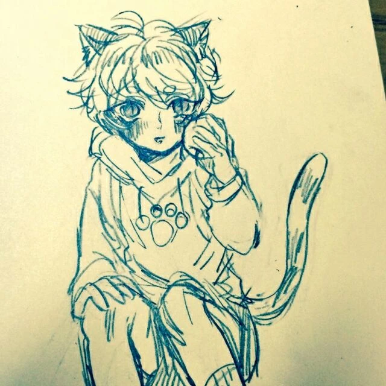
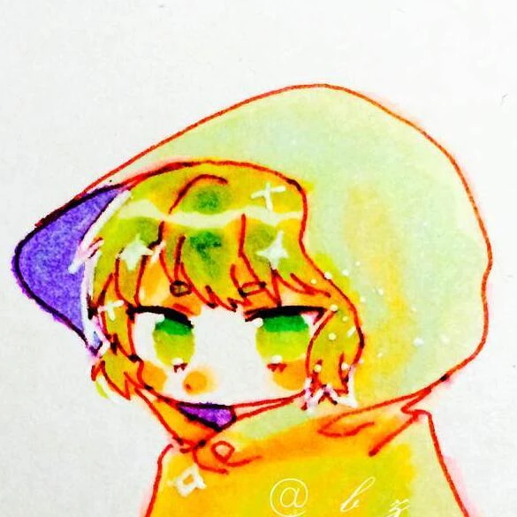
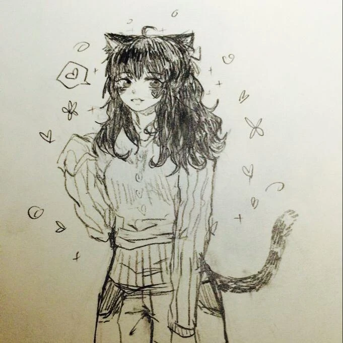

早在 2015 年的时候，我就开始亦步亦趋地制作 ~~（仿造）~~ 一些东西。早期说实话也没想过把这些东西发布出去，顶多在初中同学之间那里分享着玩。直到两年后的一节化学课上，我才突发奇想地决定挪用三个常见的元素——Ca（钙）、Cl（氯）、Ag（银）——作为我昵称的基底，一直沿用至今。

最近也是经历了许多烂事，我也好久没有机会去维护自己的博客了。既然 Ag 这个网名也终于启用，我想是时候补全一下那三个基于化学元素拟定的网络形象了。

> [!note]
> 由于一些意外，原有的所有拟设图均已佚失，只能从用过的 QQ 头像里找到裁剪版。
>
> 尽管如此，还是非常感谢当年无偿为我绘制立绘的亲友们。

## 钙
- 生命周期：2017-2021
- 种属：兽娘·猫郎[^moewiki_catboy]
- 瞳：青绿，猫瞳
- 代表色：白
- 性格：内向
- 配偶：Cl（氯）
- 喜欢的：苹果；尝试、摸索、折腾
- 讨厌的：阅读理解（

[^moewiki_catboy]: 这种分类取自[萌娘百科](https://zh.moegirl.org.cn/%E7%8C%AB%E9%83%8E)。简而言之就是“猫少年”，或者说“具有猫部分特征的男孩子”。

最早启用的设定。虽然理论上任何钙离子组成的盐都可以指代我，但中学阶段最常见的沉淀果然还是 CaCO~3~ 吧。然后“碳酸钙摘掉两个氧”，最初的名字——Caco 就确定下来了。后来又衍生出音译“卡扣”、Casheen 和相应音译“卡伸”。  
老朋友们大抵还是愿意叫我“卡”这组名字，特别是接触过的红警 2 modder 和地图师。

猫少年啊……说实话现在回头想想，可能是受到初中同好的影响也说不定。不过印象中被说“可爱”确实是很早就开始了。（话说真的可爱吗？）  
总之上图已经是我能找到尽可能完整的立绘了，看上去不需要额外添几笔细致的外貌描写。

> “他呀……是个很可爱的家伙呢。初见看着很腼腆，相谈甚欢了又开始滔滔不绝，和我独处又脸红得像熟透的苹果一样。  
> “hmm？当初怎么认识的啊……说来有点搞笑。他一开始的个人简介整了个莫名其妙的反应方程，然后我看着好玩就和他聊上咯。再然后？嘻嘻，自己猜去。  
> “搞起熟悉的东西来能心无旁骛搞个通宵……啧，有时候还挺羡慕他的。但…再怎么说也稍微陪陪我啊。明明他自己也很喜欢抱抱的说。  
> “唉，明明说好了做我的专属的……到头来还是把我抛下了嘛……”
> ::: right
> ——ChlorideP
> :::

## 氯
- 生命周期：2022-2025.3
- 种属：幽灵（♀）
- 瞳：黄绿，类人瞳孔
- 代表色：黄绿
- 性格：寡言、孤僻
- 配偶：Ca（钙）
- *伴侣：Ag（银）
- 喜欢的：听故事和讲故事
- 讨厌的：毫无营养的信源

在 Caco 因故被一小撮原神同人女~~散兵厨~~攻击之后不久，钙的形象弃用，咱也随即改名为 Chloride Pussemi，即 ChlorideP 了。而后有人因为末尾这个 P 以为我是 VOCALOID 曲师（P 主），加上这个昵称全小写起来并不方便手写，遂又更名为 NyaCl.

氯的种属启发自氯单质（氯气）的物理性质。作为气体，它是有在空中的那种飘浮感的，不难想到幽灵也是在空中飘飞的存在。于是就决定是“黄绿色的幽灵”这样的形态。上图是 Q 版氯，其实还有一版正式立绘，是个大姐姐的形象。~~可惜弄丢了。~~

后来经历的一些事情让我的精神状态逐渐贴合氯气的化学性质：有毒、刺鼻。有时候的确觉得自己到处倒垃圾很困扰人；应激起来说话很大声，不也挺“刺”耳的。（苦笑）

> “你说她？我的食物罢了。知不知道一颗电子对阳离子来说有多么诱人？  
> “刚找上她的时候她还在郁郁寡欢呢。结果呢？还不是顺从本能乖乖交粮。（舔唇）  
> “不过还别说，强氧化的元素就是不一样，比什么碳酸根的美味多了。听说她已故的另一半也和碳酸根有点关系？乐。  
> “后来一来二去的，她似乎也走出来了，愿意和我一起贴贴……嗯哼，就这点来说我还是很喜欢她的。  
> “最后倒是和她贴了个痛快。不知道她觉得如何，我是觉得她这结局挺好的。好歹舒服地享受完最后一刻。  
> “就是可惜……再也找不到这么好的食物咯……（叹气）”
> ::: right
> ——SilverAg.L
> :::

## 银
- 生命周期：2025.4-
- 种属：兽娘·猫娘（亚种，魅魔混血）
- 瞳色：粉红，爱心瞳
- 代表色：银白（亮白）
- 性格：对外满不在乎，私底下很细腻
- 喜欢的：涩涩（无论主动被动）
- 讨厌的：烦心事

> [!note]
> 将来有时间和闲钱的话，再为 Ag 这个形象重新约张稿吧。

银这个设定实际上直到去年才给她勾个轮廓——**白丝魅魔猫娘少女**。乍一听这四个词组合在一起很违和。说实话我也觉得（

相比前面两个反映我不同时期的、特点鲜明的自设，“银”这一形象就相对一以贯之，同时又很随性了。大约在初中我就误入当时流传的所谓“本子库”[^benziku]，所以涩涩也算是我一直以来的隐藏属性，如今启用这个自设也有种借谐音梗的题发挥的意思。

[^benziku]: 具体的经过已经淡忘了，我的博客对涩涩的话题也比较含蓄。可以确定的是，“本子库”、“兔纱子”、“魔法少女”这些关键词是我早期的朦胧印象，后来形成的题材偏好（或者说 xp）也是基于这个印象所做的建构。

至于这个轮廓为什么这么左右脑互搏，只能说是基于自身经历导致的历史惯性吧。钙设是猫少年嘛，加上我认识的老朋友们普遍爱发猫猫表情包，所以我的口癖不可避免地也倾向于喵来喵去，忽然摘掉“猫”这个元素反倒不知道怎么表达了（毕竟我做不到真像魅魔那样妩媚）。但我又希望能够突出涩涩的要素，所以最终形象就是点缀上白丝、魅魔尾巴、猫耳猫爪的少女啦。~~但自己想象的时候感觉更像雌小鬼一点（）~~

设定上魅魔尾巴非常敏感，只是碰触就会浑身战栗的程度。若是摸上那么一两下说不定就开始发情了吧。

> “你是怎么看我的呢，氯喵？你会要我吗？  
> “好想再被你抱着……抱在怀里，就像…就像……”
> ::: right
> ——Ag
> :::

---

## 后记
事实上我确实没想过它们之间会有什么社会关系，毕竟本质上都是我在网络上的皮套而已，它们都是我，却又不完全是。但真的做出决定，“既然我本来就没活，索性把身为创作者的我，叫做‘氯’的我给埋葬了吧”，这么做的时候，我的内心还是会觉得痛苦，仿佛真的失去了重要的人一般。

基于这样的感情，我才决定写下这一篇随笔，完善这几个自设的形象。至于每个设定底下的自白，更多地是对[友链 PR](https://github.com/Twisuki/blog/pull/4) 里的小对话做一个扩写，很抱歉我并不擅长写一个完整的故事，只能像这样侧面地刻画 CaCl~2~ 和 AgCl 这两对之间的亲密关系。

不论钙、氯还是银，都是我精神世界的投射，也都寄托了我的愿望或是欲求。也许我就是很享受被人家说可爱呢？哪怕最终只是在博客里发癫、写一篇篇的碎碎念。
