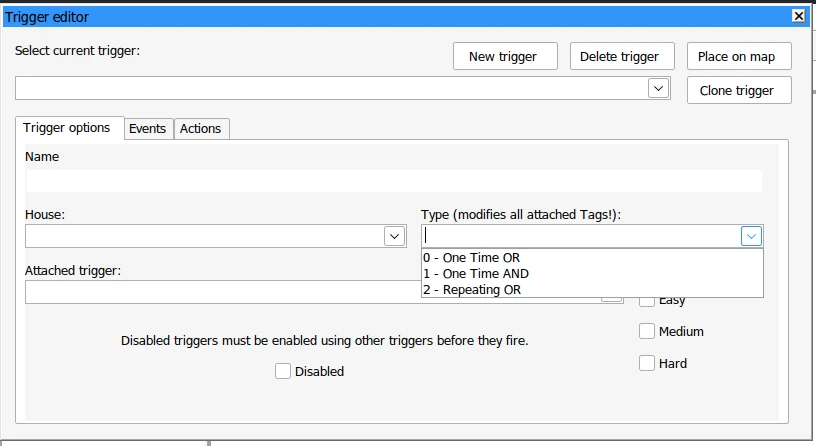

::: warning 观前注意
由于涉及一些编程知识点，本文可能存在亿些阅读困难。
虽然经过与 Zero Fanker 等人的讨论后决定做些~~修缮~~重写，但难免仍有需要改进之处。
:::

## 绪论

### 研究背景
红警 2 的地图创作中，流程设计是战役最重要的一环，其中触发发挥着举足轻重的作用。好的剧情流程能够让人印象深刻，如何用触发设计出好的流程，就得凭借地图师们的逻辑智慧了。但长久以来，红红的地图教程偏实用性居多，大多数地图师对触发并没有明晰的认识，他们或许在脑内对任务流程有着天马行空的设想，但落到触发实现上往往束手无策。

本文基于已有的触发和编程实践，尝试阐明触发组件的运作**逻辑**，并就这套系统的一些缺陷提出个人的见解，希望能够对各位读者有所启发。如果能稍稍地推进触发设计的简化事业，那就再好不过了。

### 研究目的与意义
本文旨在用程序化的思想阐述触发的运作**逻辑**（而非原理，更不是底层原理），指出这套系统存在的**逻辑**缺陷，并试着给出可行的解决思路。通过对触发**逻辑**的分析，用不同的视角去看待触发，或许可以**一定程度上**简化触发的表达，增强地图师们的逻辑思维，启发他们对优秀设计模型（如状态机）的借鉴、化用，提升剧情的观赏性，为观众们带来更多精彩的“剧目”吧。

> 必须指出的一点是：逻辑与实现并不等同。逻辑关心客观事物的**本质、规律**，实现则关心符合这个规律的**解决方案**。
<!-- ::: -->

## 一、触发组件相关概念

### 1.1 触发

地图触发是早在《命运与征服：泰伯利亚黎明》就引入的系统，负责处理地图当中的“事件”^1^。

一局游戏瞬息万变，其中总有一些**既成的、游戏引擎能感知的事，叫做事件**。比如什么关键建筑被打爆了啊，哪家缺电缺钱了，等等。
这些事件会被触发捕捉到，并驱动后者去执行相应的**行为，也就是游戏引擎能做到的各种效果**：可以是刷兵，改变光照，炸个桥，平地起心灵信标……诸如此类。

再次强调，捕获到的事件、要执行的行为，都仅限**引擎能做到的**范围之内。

> 有一些地编调整过用词，事件改称“条件”，行为改叫“结果”。你可以简单这么理解。

<!-- 在红警 2，触发更类似于高中数学中的“命题”：若 p 则 q。其中事件 p 和行为 q 都可以不止一条，并且 p1 p2 p... 之间、q1 q2 q... 之间有一定的连接关系。 -->

### 1.2 局部变量

变量系统则在《命运与征服：泰伯利亚之日》才开始出现，根据`[VariableNames]`小节所处的位置不同，
分为 Rules 里的**全局变量**，和地图里的**局部变量**^2^。本文主要讨论局部变量。

在地图创作中，局部变量就是**对设计者有具体意义的**，**会因触发**（和动作脚本）**做出改变的**，**临时在某一局游戏起作用的**数值。

值得一提的是，从原版一直到 Ares 扩展平台，局部变量均有如下限制：

- **存在数目上限**：至多能设置 100 个；
- **取值范围有限**：变量的值只能为`0`（清除）和`1`（设置）两种。

一直到 [@secsome](https://github.com/secsome) 在 Phobos 平台扩展了变量系统之后，上述限制才被打破。

> 参考链接：
> [pr#321](https://github.com/Phobos-developers/Phobos/pull/321),
> [pr#424](https://github.com/Phobos-developers/Phobos/pull/424),
> [pr#425](https://github.com/Phobos-developers/Phobos/pull/425).

::: info 扩展变量系统
船新的变量系统大大扩充了局部变量池，几乎可以认为是“无限量”使用。~~真的有人会堆料到要用 2^31^ - 1 个以上的变量吗？~~
除此之外，变量取值范围也极大地延展了。但官方文档指出，这种延展并不对等：

- **纯触发组件中**，范围可达 $[-2^{31}, 2^{31} - 1]$（即上至`2147483647`）；
- **动作脚本中**参数位有限，范围**缩减**为 $[-2^{15}, 2^{15} - 1]$（上至`32767`）。出界不保证预期效果。

至于为何会有这种缩减，还请移步《计算机组成原理》第二章：数据的表示与运算。
:::

## 二、触发组件的程序逻辑分析

> [!IMPORTANT]
> 由于本博客使用的`katex`插件不支持编写 LaTeX 伪代码，因此本文的伪代码仍然基于 Python 语法。
> 但考虑到 Python 的很多特性存在理解门槛，本文将只着眼于`if`等通用表达。

### 2.1 触发的逻辑本质
提及触发，各位地图师看过教程、初步上手后应该会建立这样的基本印象：

- 触发有一定**前置事件**。
- 触发指明了**执行行为**。
- 触发要等**前置事件（条件）完成**，才会**执行相应行为**，表现出各种结果。  

> 比如简单的延时字幕，你确实需要等上那一段时间，然后才会冒出来一句“必须重新集结部队”。

这种“等待条件”的现象与高中数学讨论的“若 p 则 q”命题（即条件命题）非常类似。一个条件命题要能判断其真伪，条件就必不可少；同样的，一个触发要能执行，首先要等待前置事件完成。在程序框图中，像这种具有前置条件的语义用**条件分支**表示（如下图），又称**选择结构**。


从游戏实际运行的现象来看，触发会在条件满足（为真）后执行相应的“处理程序”（也就是行为），这一点符合基本印象。而当条件**尚未满足**时，触发则阻塞等待。  
假如**逻辑上**就是希望判断条件不满足（为假），由于触发一直等不到条件满足，则直到游戏结束为止这个条件都得不到任何处理。如此看来，触发的逻辑本质就是如上左图的**条件单分支结构**。

而在程序语言里，这种条件单分支常用`if`表示：

```python
if condition:  # 条件
  do_sth()  # 结果
```

在这段代码中，只有当条件`condition`满足（为真），才会去走`do_sth()`那一步，执行出结果来。
而触发也是等到条件满足，才会执行结果。既然如此，抛开触发的所属、难度开关等等其他属性，不妨就把一个触发当成这种`if`结构。

> [!note]
> 1. 为了方便讨论，本章 *Q53/Q54 允许/禁止触发* 不会直接使用`do_sth()`这种函数表示。
> 2. 如没有文字说明，文中使用到的触发条件、结果会在号码前面标明 P、Q 加以区分。

至于事件`condition`和行为`do_sth()`，事实上它们可以不止一条。多条件姑且不论，有些朋友可能很喜欢在单一触发里塞十几条结果。
那么多个条件、多个结果之间是如何串起来的呢？你可以自行翻阅各扩展平台的 YRpp，或是在 FA2 等地图编辑器中实验一下，这边就直接说结论了：

- 多个条件之间**以逻辑且（AND）连接**，所有条件**必须全部满足**，才可以执行对应的结果；
- 多个结果之间形成队列**按序执行**，但因为每一条结果执行耗时很短，表面上看似乎是同时完成。

至此，可以用这样的伪代码描述一个触发的 $p_1 \land \ldots \land p_n \to Q$ 逻辑了：
```python
if event1 and event2() and ...:
  action1()
  action2()
  ...
```

::: details 参考资料：触发行为在 INI 和引擎中的实际表示

以触发行为为例，触发行为在地图里是这种 INI 表示：
```ini
01019810 = len_actions, a1_type, a1p1, a1p2, ..., a1p6, a1_wp, a2_type, ...
```
在游戏引擎中，一条 Action 由`TActionClass`管理（下列声明有所省略，详见 [YRpp](https://github.com/Phobos-developers/YRpp/blob/c8d4da4f57a80a3cc2b9ecbde56c335e082c8335/TActionClass.h)）：
```cpp
class TActionClass : public AbstractClass {
public:
	TriggerAction      ActionKind;  // aX_type
	union {
		RectangleStruct    Bounds; // map bounds for use with action 40
		struct {
			int Param3;
			int Param4;
			int Param5;
			int Param6;
		};
	}; // It's enough for calling Bounds.X, just use a union here now. - secsome
	int                Waypoint;   // aX_wp
	int                Value2; // multipurpose  // aXp2
	int                Value; // multipurpose   // aXp1
};
```
其中 P1 决定了 P2 参数的类型。由于 P3-P6 均为`int`类型，无法满足文本、数值、触发等多种类型需求，所以由 Value (P1) 采取类似`enum`的设计，Value2 则记录真实参数 P2 的指针地址。
:::

::: details 参考资料：触发行为的具体实现
游戏引擎仍然用`TActionClass`声明和实现原版的行为（也就是地编靠前的 100 多号），扩展平台则用`TActionExt`实现扩展。
以 Phobos 的 *编辑变量* 这一结果为例：
```cpp
bool TActionExt::EditVariable(
  TActionClass* pThis, HouseClass* pHouse, ObjectClass* pObject,
  TriggerClass* pTrigger, CellStruct const& location)
{
  // blabla
  return true;
}
```
- `pThis`为`TActionClass`的指针，在参考资料「触发行为在 INI 和引擎中的实际表示」中已经介绍过，它可以记录行为参数；  
- `pHouse`系触发所属方，比如行为 *36 全部更改所属* 要变走\*触发所属方\*的全部东西。  

其余的函数形参本人没有具体研究过，恕不做介绍。
:::

### 2.2 顺序结构

顺序结构是最简单、最基本、最符合思维直觉的结构。大部分战役任务的流程也都是线性、有序的流程。以被广为改编的《脑死》为例，它的任务流程具有很典型的顺序性：

1. 建立一座~~锅盖~~苏军雷达
2. 超时空援军就位后，摧毁最后一座心灵控制器
3. 秋风扫落叶，清除残余敌军。

在线性系统中，**按时间先后执行的流程**我们认为就是顺序结构^3^。

然而两个触发之间常常在宏观上表现为异步：同样都是延时 10s，A 触发和 B 触发看起来好像是同时执行、互不相干的。那要如何保证顺序呢？
一个简单的办法是用行为 *53 允许触发*。假定有两个触发 $t_0$ 和 $t_1$，要求先触发 $t_0$ 后触发 $t_1$。只需在触发编辑器里完成如下步骤：
- 为 $t_1$ 触发勾上“禁止”选项；（$t_0$ 无需再做处理）
- 在 $t_0$ 触发的行为（或者结果）页面中，添加一项（行为类型选中 53，参数选择 $t_1$ 触发）。

如需链式允许一系列触发，比如 $t_1 \to t_2 \to \ldots \to t_n$ ，也是如法炮制。以此类推，就形成触发链：


而在程序代码当中，顺序是通过代码行的先后次序来体现的：
```python
x = input("输入 x：")
y = input("输入 y：")
print(x + y)
```
可以很清楚地看出，这段程序先读入`x`，后读入`y`，最后输出它们两相加 ~~（实际上是拼接）~~ 的结果。**自上而下、逐行执行**，这就是程序代码的顺序结构。

从 [2.1 一节](#_2-1-触发的逻辑本质)的讨论可知，触发在逻辑上可以表达成`if`单分支的伪代码。那么不妨将这些`if`也按照地图师期望的顺序，自上而下地排列起来：
```python
# t0. start
if anyEvent:  # P8 任何事件（当*单独使用*时，它会令触发*立即执行*）
  lock_input()  # Q46 禁止用户输入
  play_speech("EVA_EstablishBattlefieldControl")  # Q21 播放 EVA 语音

  # t1. intro.brief.A
  if elapsedTime(6):  # Q13 流逝时间
    text_trigger("mission:naosi_A")  # Q11 文本触发
```
其中，$t_0$ 触发的条件是`anyEvent`。结合右边的注解和前面对于`if`执行过程的讨论，这个条件肯定是恒满足的，也就是为真（`True`）。

上述代码段的排布与前面的案例一致，$t_1$ 是排在 $t_0$ 后面的，这样 $t_1$ 必定会等 $t_0$ 先触发；除此之外，$t_1$ 还往右缩进，与 $t_0$ 的那两条结果对齐，意味着 $t_0$ 不触发时，绝对不会触发 $t_1$，以此避免独立触发和触发链的歧义。

但随着触发链越来越长，这种层层缩进的形式也会因为不同结果的穿插变得混乱不堪。除此之外，这种表示也很难解释行为*54 禁止触发*。由于本人水平有限，如何解决这些缺陷、让逻辑表达更贴近 Q53、Q54 的表述，就权当是留给有兴趣的读者一道思考题吧。

### 2.3 循环结构
早期扩展平台对于屏幕界面的利用并不充分，地图师只能每隔一段时间在屏幕左上方提示玩家当前的任务目标。那么像这种需要**重复执行同一个流程**的结构，就叫循环结构。

对于循环结构，[已知的触发教程](https://www.bilibili.com/video/BV1Zw411y7DZ?spm_id_from=333.1387.collection.video_card.click)大概会让你关注触发的「重复类型」：



通常来说，选择 *2 - Repeating OR* 那一项便足以满足很多简单的重复需求。

::: info 重复类型
事实上，用重复这个概念描述触发（实际上是标签）的类型并不准确。由于本文内容不允许做过多展开，有机会再单独做个“实验”。
:::

而在程序代码中，`while`循环则取代`if`扮演这个执行重复主体的角色：
```python
while True:
  print("Hello World")
```
将上述代码粘贴进 Python IDLE 回车运行，你也能看到终端里打出来一行行`Hello World`，除非用任务管理器干掉这个进程，否则它会无休止地输出下去。

分析这个运行表现不难发现，它是类似下图图二的流程：首先它走到`while`处执行判断，由于条件恒满足，往下执行`print`；然后循环并没有结束，它重新回到`while`重复执行前面说的流程，将坏掉的乐土打字机事业推进下去~~爱莉希雅死辣~~。


上面的`Hello World`案例也是类似图二的流程。于是，重复触发可以用`while`循环表示：
```python
while elapsedTime(6):  # 每隔 6 秒
  text_trigger("mission:naosi_enemyarmada")  # 输出文本
  reinforcement("01014514")  # Q7 援军（小队）
```

### 2.4 线性多分支选择结构
在触发设计中，有的时候还会希望在某一个节点，根据不同的情况分别做出不同的反应，这就涉及到了选择。选择结构是创建分支流程的重要组成部分，可用于实现**条件发生变化时流程也随之发生改变**的效果^3^。

选择结构其实前面 [2.1 一节](#_2-1-触发的逻辑本质)已经介绍过，并且基于触发运行的现象指出触发本质是“条件单分支结构”。由于存在阻塞等待，触发并不会主动判断条件不满足（为假）的情形，所以在实际应用中比起去实现双分支，地图师更倾向于关注**多个条件分支**之间如何组织。

> [!tip]
> 实际上借助局部变量也可以实现双分支选择，但并不是本章的重点。详见 [3.3.1 小节](#_3-3-1-门电路的搭建)。

当大量的选择结构简单串联之后，实际上就构成了线性多分支结构^3^。而在涉及到多个条件时，不同条件之间的关系也会影响选择结构的实际效果。具体来说，是互斥与否的关系。

**互斥**是说，这组条件分支**不可能**同时满足，因此必然只会运行**其中一个**处理程序。用程序语言来说，就是`if-elif-else`。比如用公式法求一元二次方程，不可能 $\Delta > 0$ 还说方程找不到实根。  
**非互斥**是指，多条件中**至少有两条**同时满足，有可能**同时经过若干个**处理程序。比如说重叠区间：

- 若 $x \in (0, 233]$，则令 $x = -x$；
- （反之）若 $x \in (220, 512]$，则又令 $x = x^3$。

如果没有加上那个“反之”，考虑输入一个特殊值 $x = 230$：首先 $230 < 233$，$x$ 变换成 $-230$；随后 $230 > 220$，对 $-x$ 做幂运算得出 $-12,167,000$。  
而一旦加上“反之”，上述处理就是互斥的：**“反之”要求 $0 < x \le 233$ 这一条件首先不满足**。对于特殊值 $230$，显然 $230 < 233$ 满足条件，$x$ 变成 $-230$ 就直接结束了。

由于触发的 $p \to q$ 语义无法通过逻辑上互斥实现选择，因此实践中更倾向物理实现这个互斥：一旦某一分支成功触发，就需要**尽快阻止触发其他分支**。实践中通常会考虑 *Q54 禁止触发*、摧毁选择器等方式，让用户**来不及**进入另外的分支。

比如近年来的子阵营指挥：设有三支部队分别从三个方向开进，你需要**选择**指挥其中一支。这种桥段通常会刷三个假单位充当选择信标，玩家选中一个就把那一路部队更改所属。那么这种情况会在玩家选择之后*立刻摧毁其他选择信标*（*Q119 摧毁所属方*）。

```python
if objSelected(BeaconA):
  del BeaconA, BeaconB, BeaconC
  ...
# B、C 信标也是一样，就不再展开了。
```

非互斥的多分支实际上就是**顺序地经过这些条件分支**，如此便又回归顺序结构的处理方式。其中比较典型的设计类似数学上的“大、小前提”。
考虑一个争夺战：玩家与敌军互相争夺油田，但狡猾的敌军可能直接摧毁油田。假如有两个 Phobos 扩展局部变量充当计数器：
- `remaining`计算地图上还有多少油田。若余量小于玩家应占数目，任务失败；
- `player_owns`计算玩家占了多少油田。大于等于应占数目，任务完成。

那么当一个油田 *P48 被摧毁* 时，首先想到余量`remaining`减一。*如果这个油田先前是玩家持有*，那就再对`player_owns`减一。简单的允许触发即可：

```python
if objDestroyed(OilA):
  remaining -= 1  # 编辑变量 (Phobos)
  if oil_A_captured and objDestroyed(OilA):
    player_owns -= 1
```

## 三、局部变量的程序逻辑分析
前面的分析都是基于触发系统本身，贴的代码也只是对假想条件和结果的调用。而在地图创作中，除了直接利用已有的条件库，还会用局部变量间接地做条件判断。为了讲清楚它如何参与到触发逻辑当中，不妨引入经典案例“运输船找妈妈”。

### 3.1 案例实现思路
“运输船找妈妈”简单来说，就是在**乘客还有事要做**的情况下，让运载乘客的**载具打哪来，回哪去**。观察一下 YR S01：时空转移的相关演出，易得流程如下：

- **满载**的运输船从地图外刷出，移动到定点；
- 等待所有乘客下船。然后乘客有可能还会打光几秒、更改所属方……；
- **空载**的运输船从定点返回地图外。

难点就在于，如何得知**卸出乘客后船是空的**。翻看条件库，好像也没有类似的选项。  
于是考虑设`apc unload`变量初始为 0，然后在运输船卸出乘客之后*Q56 设置局部变量*，触发得知 *P36 局部变量被设置* 了，就建一个空船小队把它拉走。

> [!note]
> 篇幅原因，具体实现步骤我就不贴出来了。这种实用向教程应该也很容易找到。

### 3.2 案例逻辑分析
已知这一经典例子中运用了局部变量，那么引入局部变量后触发逻辑有什么变化呢？

首先考虑局部变量的位置。从语义、代码语法上说，不可能未经定义就使用一个变量——好比解应用题，只设了未知数`x`却凭空跑出个`y`来。

在 FA2 的局部变量窗口中，你需要为局部变量起名（声明），然后 FA2 默认会令它等于 0（初始化，当然你可以改这个初始值）。那么这些局部变量保存到地图里肯定也是带着初始值的。  
这些局部变量最终又被引擎读进内存，组成数列（或者说数组）。所以，**在游戏开始之前，这些变量就已经就位了**。

那么不妨把局部变量放在程序代码的开头：
```python
apc_unload = 0  # 多数编程语言并不允许变量名带空格
if ...:
  ...
```
既然声明了局部变量，那么就要用起来。触发里有一组事件和一组结果分别读写局部变量（设待操作的局部变量为 $x$）：

- P36：局部变量被设定（为 1），即当 $x = 1$ 时
- P37：局部变量被清除（0），即当 $x = 0$ 时

* Q56：设置局部变量（值为 1），即令 $x = 1$
* Q57：清除局部变量（值），即令 $x = 0$

::: info 赋值与相等
在数学中描述等量关系用等号：`a = 0`时，……。同时，赋值也用等号：令`x = 1`。  
而在编程中二者是不同的运算。为了避免混淆，你经常会看到用`==`指代相等，用`=`来赋值。
:::

那么上述案例便可以用如下伪代码表示：
```python
apc_unload = 0

if elapsedTime(20):
  play_speech("EVA_ReinforcementsHaveArrived")
  reinforcement("LCRFCome")

if apc_unload == 1:
  create_team("LCRFBack")  # Q4 建立小队
```

触发就是通过对局部变量值的变动，来实现一些较为复杂的逻辑判断。并且随着 Phobos 扩展了变量系统，触发对变量的判断也不再局限于 0 和 1 的“左手倒右手”，而是与科技类型、超级武器、随机数等联系了起来，实现更加精细的随机机制和流程控制。

### 3.3 高阶用法：逻辑门电路

触发条件仅以**逻辑“且”** 相连。其阻塞等待决定了它没有类似“否则”的设计，也就莫得直给的逻辑“非”；已知的触发实践也表明，多条件不可能在仅满足其中一个的情况下执行触发，无法直接判断逻辑“或”。那是否说明，触发就是做不到逻辑完备，如同早期面对平台限制一样无解呢？非也。

事实上，依据软硬件的逻辑等价性原理，触发确实可以做到或、非逻辑的判定。但显然，用累加去实现相乘，比起直接列个竖式配合九九乘法表，总是麻烦得多。自行实现的或、非逻辑也一样。

#### 3.3.1 门电路的搭建

> “逻辑智能所有的基础，都不过是这小小的开关。”
> ::: right
> ——ElectroBOOM
> :::

在 [1.2 一节](#_1-2-局部变量)中已知，原版的局部变量只有`0`和`1`两种取值，恰如一个“开关”。前面两个小节的实例分析也展示了局部变量作为“开关”，在触发系统中的**辅助判断**作用。有了开关，就可以人为建立起“或”、“非”，乃至更为复杂的逻辑通路。

我们不妨从先前一直遗漏的“条件双分支结构”入手。很显然，双分支摘去一支就退化为了单分支；反过来，双分支的真、假两路恰好是一个开关的两极。那么有没有可能，可以通过局部变量连结两个单分支，组合成一个“条件双分支”呢？这就是接下来要讨论的单刀双掷开关（SPDT）设计。

从 [3.2 一节](#_3-2-案例逻辑分析)的介绍可以看出，触发是取局部变量的**瞬时值**做的判断，变量值为`0`还是为`1`是两个独立事件。既然**逻辑上**通过局部变量反映了条件的真假，不妨假设经过这个双分支时，该局部变量的值“保持恒定”，于是得出以下的实现思路：
```python
# t0: if-else 双分支：条件判断器
if elapsedTime(114514) and ...:
  your_local_var = 1
# t1: 条件为真时的处理
if your_local_var == 1:
  ...
# t2: 条件为假时的处理
if your_local_var == 0:
  ...
```
注意前面 2.4 讨论多分支时，还提到要“尽快阻止触发其他分支”。在上面这个简单模型中，令 $t_1$ 第一时间“禁止”$t_2$，反过来也一样，就可以了。

事实上，不单是局部变量，像 YR A03：集中攻击那关争抢电厂的桥段，“电厂是否属于玩家”也可以采用 SPDT 设计，直接判断关联电厂的归属是敌是友，并相应地允许（或禁止）敌军反占电厂的演出。

像这样将条件映射到局部变量，用变量代为影响执行流的“逻辑电路”思想，接下来会多次体现。

#### 3.3.2 或运算——殊途同归
如今的任务有一个利好玩家的设计：如果你实在没钱（假定低于 $100），**或者**你的矿车被打没了，就给你派送几个钱箱子救急，所谓“战争援助”。不妨以这个设计为例。

那首先判断“缺钱”是有现成事件*52 金钱低于* 的；至于判断“缺少矿车”，在原版中可反向考虑用事件*20 生产特定类型的载具* 判断玩家生产了矿车。如果任务流程足够简单，玩家和其他 AI 阵营*绝不可能生产出相同种类的矿车*，也可以用 YR 的事件*61 科技类型不存在*。

条件输入、结果输出两端都 OK，就可以用局部变量搭建“或门”电路了：
- 设一局部变量`player low funds`，**初值为 0**；
- 触发 $I_1$：若玩家\*金钱低于\* $100，则令该变量值为 1；
- 触发 $I_2$：若玩家补牛（没有牛车），也令该变量值为 1；
- 触发 $O$：若该变量**值为 1**，则在指定路径点刷出奖励箱子。

对应的伪代码如下：
```python
player_low_funds = 0
if creditsBelow(100):
  player_low_funds = 1
if noMiner:  # 取决于你怎么判断玩家缺牛车
  player_low_funds = 1
if player_low_funds == 1:
  create_crate(0, waypoint=81)  # 参数写 0 表示*大量金钱*
```

“一真皆真”，这就是或门的精髓。当然 Python 里真正的`or`有短路特性，这里就不再展开了。

#### 3.3.3 非运算——逆向思维
原版 RA2 A08 有这样一个任务流程：在心灵信标影响到谭雅之前摧毁心灵信标。换言之，要求指定时间内摧毁目标（也就是计时器**没有超时**，并且目标被摧毁）。

在开始之前，不妨先捋一捋这个条件组的逻辑。这实际上是个必要不充分条件：要保证*完成流程*，必需满足以下两个分条件：（一）没有超时，计时器没有走完；（二）目标被摧毁。但反过来，单纯“没有超时”推不出任务完成——目标可能还在。

由于*目标被歼灭* 这个分条件不需要非运算，因此重点关注 *流程能完成 $\Rightarrow$ 没超时* 这一分路。这一路条件按照设计得是真命题，原命题为真，其逆否命题也为真：*超时了 $\Rightarrow$ 流程完不成*。这样就得到非运算的关键实现了。

有思路之后打开触发编辑器，现有这些条件与计时器有关：流逝时间、计时器时间到、流逝游戏时间……无不判断一个计时器*超时*。根据刚刚得到的逆否命题，用局部变量实现“非门”电路：

- 设一局部变量`obj1 reachable`，**初始为 1**；
- 触发 $I$：若计时器超时，则令该变量值为 0；
- 触发 $O$：若变量值**仍为 1**（即未超时），且目标不再存在，则宣布任务完成。

对应的伪代码如下：
```python
obj1_reachable = 1
if timeout:  # 取决于你用 P13 P14 还是 P47
  obj1_reachable = 0
if obj1_reachable == 1 and techTypeNotExist("NAPSYB"):
  play_speech("EVA_ObjectiveComplete")
  ...
```
---

当然，虽然理想很美好，但从原版一直到纯 Ares（特别是 Hares 平台），100 个局部变量的限制依然不容忽视。对于有限的资源，还是需要做出合理的分配。

<!-- ## 四、触发时序与标签 -->

## 结论

综上所述，红警 2 的触发组件在任务设计当中举足轻重，把握其运行的逻辑，有利于互相交流（至少不需要甩一堆截图）、有利于把更精妙的脑洞付诸实践、有利于优秀触发设计的提炼与发掘，对于触发编写乃至地图创作都有重要意义。

触发系统在逻辑层面上类似`if`单分支语句的设计，使其就入门而言并无太大门槛；支持顺序、选择、循环三种结构，可以实现大部分任务所需的线性叙事。然而其在逻辑运算上又有所欠缺，稍微复合一点的或、非逻辑判断必须通过局部变量绕路实现，对于地图师的逻辑思维能力是一大考验。

## 参考文献

1. ModEnc. [Triggers](https://modenc.renegadeprojects.com/Triggers) \[EB/OL\], 1.31.2024, 6.17.2024.
2. ModEnc. [VariableNames](https://modenc.renegadeprojects.com/VariableNames) \[EB/OL\], 5.16.2024, 6.17.2024.
3. RN Studio. [map_tutorial](https://github.com/revengenowstudio/map_tutorial) \[EB/OL\], 4.29.2024, 5.6.2024.

> [!NOTE]
> 便利起见，文献附注格式基于 GB/T 7714 规范作了简化。

## 致谢

时光荏苒，距离最开始做大白板雪原、遭遇战一样的战役地图应该也有九个年头了。能够写到这里，全拜各位大佬、同行、玩家朋友所赐。Lin 在此谢过诸位。

首先，感谢 RN Studio 指导本次“实验”。感谢制作组的地图教程，为“选题”指引方向；感谢 Zero Fanker 等人提出的指导和改进意见，以及触发实际执行的补充、佐证和更正。

其次，感谢曾经与仍在为红警 2 模组创作贡献智慧的各路人才，为论证提供各种帮助。特别感谢地图师同行们对触发系统所作的各种实地测试和表述修订，同时感谢 Phobos 团队开源触发组件的扩展实现，以及 Heli 等人为简化地图开发所做的各种尝试。

最后，感谢各位喜爱战役的红红玩家，特别是《星辰之光》的测试员和玩家朋友们拨冗测试和体验。

## 后记
比起“逻辑”，modder 们始终更在乎切实的、能实装进游戏和编辑器的改善。除此之外，红警 2 的触发逻辑本身就与“引擎实现”密不可分。比如：

- 越靠近`[Triggers]`小节头的触发越容易触发；
- *通过所属方的启动是经由所属方的某个函数执行的，此函数调用为**每 8 帧一次**，根据所属方列表从上而下依次执行。*（[FA2spHDM](https://github.com/handama/FA2sp/releases) 附文档）
- *包含两个**非持续伴随事件**的触发永远不会启动，因为这两个事件是相继发生的，而不是同时发生的，因此永远不可能同时满足条件。*（FA2spHDM 附文档，有关概念参见 [Ares 文档](https://ares-developers.github.io/Ares-docs/new/triggerevents.html)）
- ……

凡此种种，都加深了我个人的自我怀疑——我写这些真的有意义吗？  
但至少我是很想找到“存在的意义”的。所以哪怕本文多么“空中楼阁”，至少就让它烂在这里吧。

::: right
04.19.2025
:::
